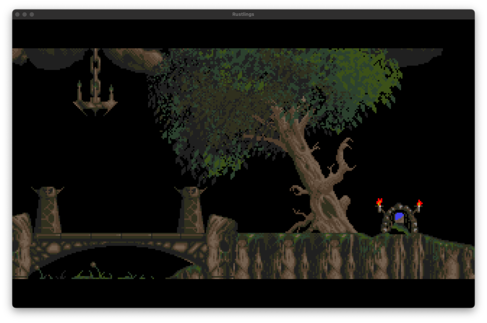
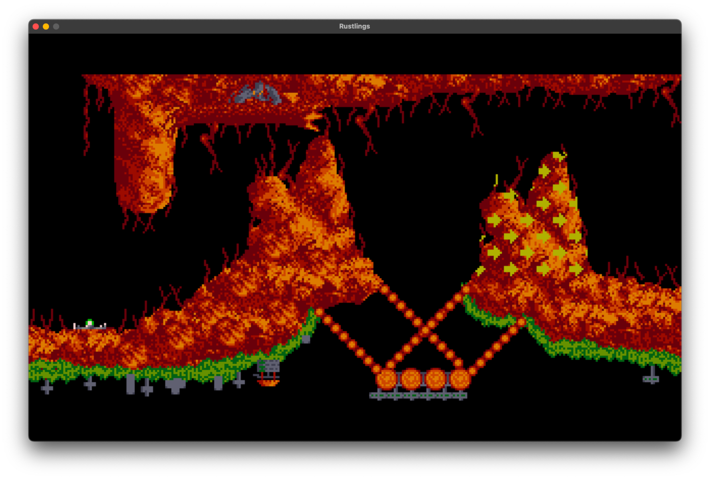
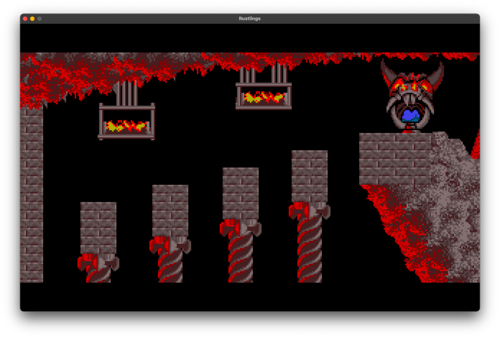

# What is this?

This is decoder and viewer for the game and level files of the MS-DOS version of
Lemmings. It may grow into a game at some point. Then again, it might not.

</img>
</img>
</img>

# Building

You need Rust, Cargo and SDL2 installed. Do

```
   % cargo build -r
```

in order to do an optimized build. Run it on the shell in order to get help on
the various subcommands.

# License

This program is free software: you can redistribute it and/or modify it under
the terms of the GNU General Public License as published by the Free Software
Foundation, either version 3 of the License, or (at your option) any later
version.
