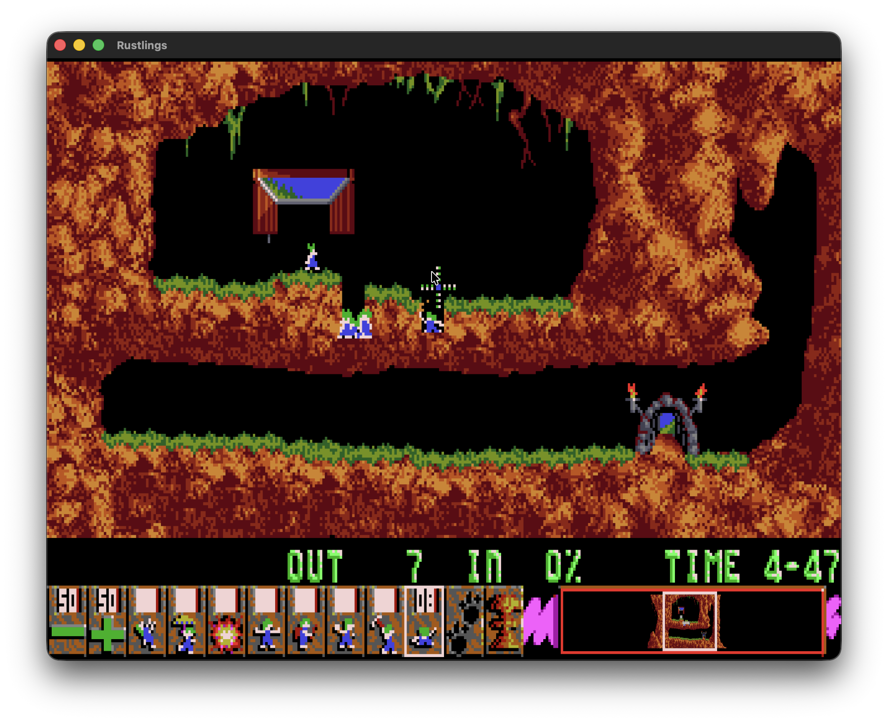
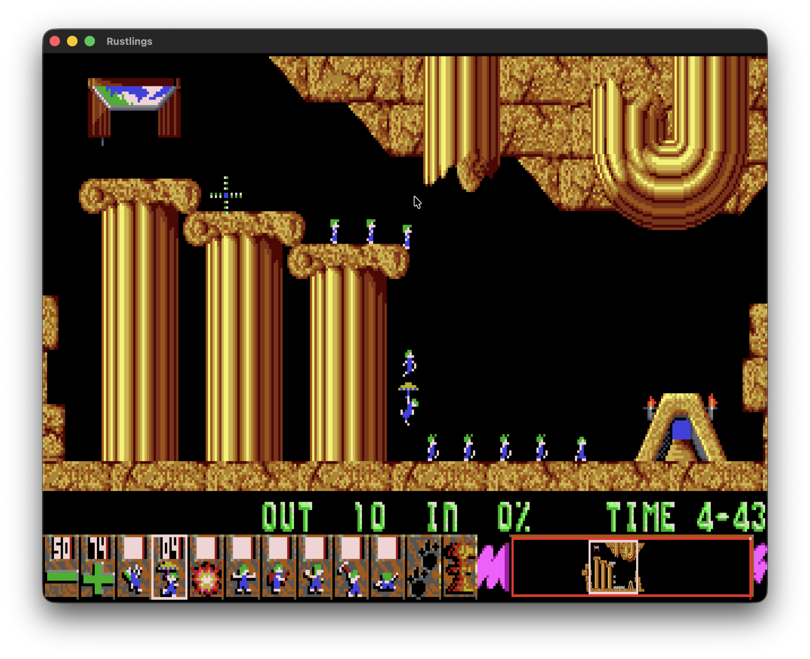
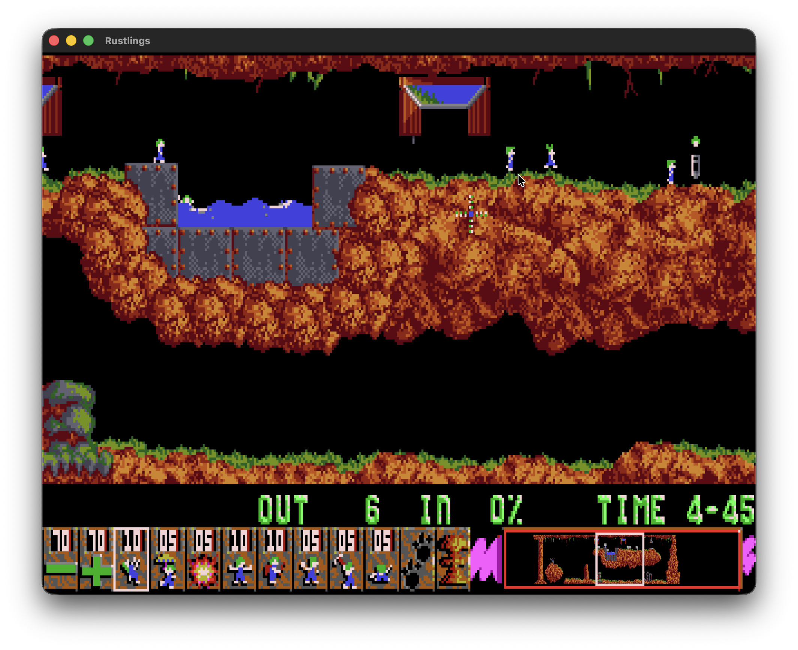

# What is this?

This is an in-progress replacement engine for the DOS game Lemmings. It is built
to act as a drop-in replacement for the original DOS executable with pixel-exact
physics and high-quality upscaled graphics rendered at the native screen refresh
rate.

The game loads all original levels in the correct order, the interface is fully
working, and I am currently in progress of implementing the skills. As skills
get implemented, more and more levels become completable. Still missing are

- Bashers, Miners, Bombers, Builders, Blockers
- Steel areas
- Level finish conditions --- nothing happens if all lemmings are gone or the
  time runs out
- Menu and level screens
- Audio

Graphics make heavy use of GPU rendering. SDL software rendering works, but
expect a hefty CPU load without acceleration. With acceleration, CPU load is
minimal (as it should be for something that ran on a 80286 😛).

</img>
</img>
</img>

# Building

You need Rust, Cargo and SDL3 (optional) installed. Do

```
$ cargo build -r
```

in order to do an optimized build. The game builds and runs on MacOS, Linux and
Windows.

If you don't have SDL3 installed (looking at you, Windows), you can do

```
$ cargo build --features sdl3/build-from-source-static -r
```

to build and link SDL3 statically on-the-fly.

# Running

Run the game with

```
$ ./target/release/rustlings <path to DOS files>
```

Keybindings:

- **Page up / down**: next / previous level
- **Left / right**: scroll (hold shift or right mouse button for fast scrolling)
- **1 -- 8**: switch skill
- **Shift**: hold to emulate right mouse button
- **p**: pause

# References

- [File formats](https://www.camanis.net/lemmings/tools.php) on the Lemmings
  archive
- I use the [Lemmix](https://github.com/ericlangedijk/Lemmix) source as a
  reference for game physics (together with pixel-by-pixel comparisions against
  screen recordings from dosbox)
- Several details like the level code encoding are reverse engineered from the
  original DOS binary with [Ghidra](http://ghidra.net)

# License

This program is free software: you can redistribute it and/or modify it under
the terms of the GNU General Public License as published by the Free Software
Foundation, either version 3 of the License, or (at your option) any later
version.
